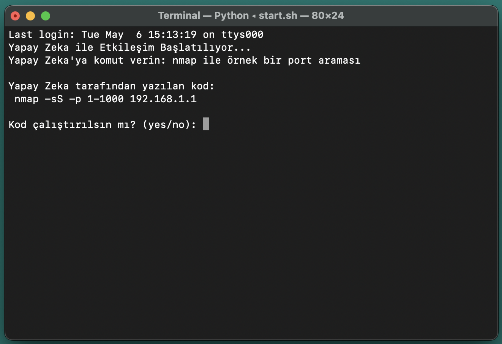

# 🧠 AI Terminal Assistant for macOS / macOS için Yapay Zekâ Destekli Terminal Yardımcısı

## 🔍 Description / Açıklama

An AI-powered terminal application for macOS that allows users to interact with their terminal using natural language. The assistant interprets user input and generates shell commands, then asks for confirmation before execution — perfect for beginners, forgetful users, or anyone who wants a smart assistant at the command line.

macOS için geliştirilen bu yapay zekâ destekli terminal uygulaması, kullanıcıların doğal dil ile terminalle etkileşime geçmesini sağlar. Kullanıcıdan gelen metni yorumlayarak uygun terminal komutlarını üretir ve çalıştırmadan önce onay ister. Yeni başlayanlar, komutları hatırlamakta zorlananlar veya terminalde daha akıllı bir deneyim isteyenler için uygundur.

---

## ⚙️ Features / Özellikler

- 🧠 Natural language to command conversion  
- 💬 The AI only generates terminal commands for macOS based on user input — no general conversation, only code. 
- ✅ Yes/No confirmation before execution  
- 🖥️ macOS-native terminal integration

---

## 🚀 Getting Started / Başlarken

### Requirements / Gereksinimler

- macOS (tested on Apple Silicon)
- Python 3.8+
- DeepSeek API key (or another one)
- Optional: Homebrew for setup

### Installation / Kurulum

```bash
git clone https://github.com/elifarslancelik/yz.git
cd yz
chmod +x setup.sh
./setup.sh

or

Open your ~/.zshrc file using the terminal
~/.zshrc dosyasını terminalde açın

nano ~/.zshrc

Add the following lines:
Dosyaya şu satırları ekleyin:

export PATH=$PATH:/Users/username/bin
/Users/username/Desktop/yz/start.sh

Note: Be sure to replace /username/ with your actual username.
Not: Gerçek kullanıcı adınızla /username/ kısmını değiştirdiğinizden emin olun.

Save the changes and close the file:
Değişiklikleri kaydedin ve dosyayı kapatın.

Run source ~/.zshrc to apply the changes:
Değişikliklerin geçerli olması için source ~/.zshrc komutunu çalıştırın.

Now you can run the assistant using the terminal.
Artık terminal üzerinden asistanı çalıştırabilirsiniz:

```
## 🖼️ Screenshot


